# Pokémon Visualization Project Proposal

##Basic Information
Title: Pokémon Visualization  
Names: Max Levine, Yuchen Liu, Qi Wang  
E-mail Addresses: mflevine@wpi.edu, yliu4@wpi.edu, qwang12@wpi.edu  
GitHub Ids: mflevine, yliu4, QiWang19  
Project Repository: https://github.com/mflevine/PokeVis  
  
##Background  
Our project will be based on the data set from Pokémon. Pokémon is a series of video games developed by Game Freak and Creatures Inc. Over the years, the game has been adapted to animated television shows and movies, comic books, and toys.  Especially, in July 2016, a game for iOS and Android devices named Pokémon Go was released. After releasing, Pokémon Go has become the fastest game to top the App Store and Google Play. There is a popular trend to play this game around the world. So we think it would be meaningful to visualize the data in this series game. This kind of visualization would appeal all the people who played the game or heard of the game.  
  
In the game, there are fictional species called Pokémon. By the end of year 2016, there were totally 802 Pokémon. All the Pokémon are divided roughly by generation. When each generation begins, the number of Pokémon and Pokémon properties will be updated. Our project will mainly focus on the change on each generation and each Pokémon.  
  
Firstly, we want to know the proportion of different type of Pokémon in each generation. Which type of Pokémon becomes much more in a new generation? We also want to know the profile for each Pokémon with respect to different properties. And how did the properties of each type of Pokémon vary with generations? Apart from the base stats, we also want to describe the change of weight in different generation. After seeing our visualization, people will understand the Pokémon’s characteristic of different generation and easily know the advantages of different type of Pokémon.  
  
##Data

Two data source so far: https://www.kaggle.com/abcsds/pokemon And https://github.com/veekun/pokedex/blob/master/pokedex/data/csv/pokemon.csv  
  
For Pokémon images: http://pokemondb.net/  
  
If more attributes are needed in the future, we may get these information by calling Pokémon API https://pokeapi.co/docsv2/  
  
##Data Processing  
Right now, there are two sources files; File1: Pokémon with its combat attribute and File2: Pokémon with its size attributes. Firstly, File1 contains some duplicated data, such as there are three No.6 Pokémon with different name (in different version of game). The team will do the basic data cleaning by removing these duplications. After that, the team will join both files by Pokémon id. Because both files contain all 721 Pokémon and they are already sorted by Pokémon id, so, this step can be done in Excel spreadsheet directly.  
  
The attributes we plan to use: Pokémon id, name, type, total, HP, attack, defense, special attack, special defense, speed, generation, height and weight.  
  
##Visualization Design

For showing the type of different generation, we choose the bar chart instead of pie chart. Because there are so many types. A pie chart becomes less effective if it uses too many pieces of data and differences between some pair of slices are hard to tell.  
  
In the bar chart, we will make different colors of bars for different generation. The height of bar stands for the number of some type of Pokémon. We will also add a slider to easily to decide which generation to show.   
  
We decide to use radar chart to show basic stats of different Pokémon. Using radar chart is a good method to show multivariate data just like the attributes of Pokémon. Radar chart is good to tell which attribute is most strength and which is weakest.  Besides, we can also draw more than one Pokémon in a radar chart to make comparisons between different Pokémon.   
  
We will describe each Pokémon using radar chart in each generation. We will make a box for user to type to search a Pokémon.  
  
In order to take a look at the distribution of weights of the Pokémon throughout the generations, we decided we are going to use a bubble chart. Our reasoning is that weight is associated with size so it makes sense that we would encode it with size. The bubbles will labeled with the picture of the respective Pokémon so the viewer is more interested. We also want to encode the type of the Pokémon with color. A slider will allow the viewer to easily change which generation they are looking at.  
  
Below are our final visualization designs, and as for alternative choices, please refer to Appendix: sketches. 
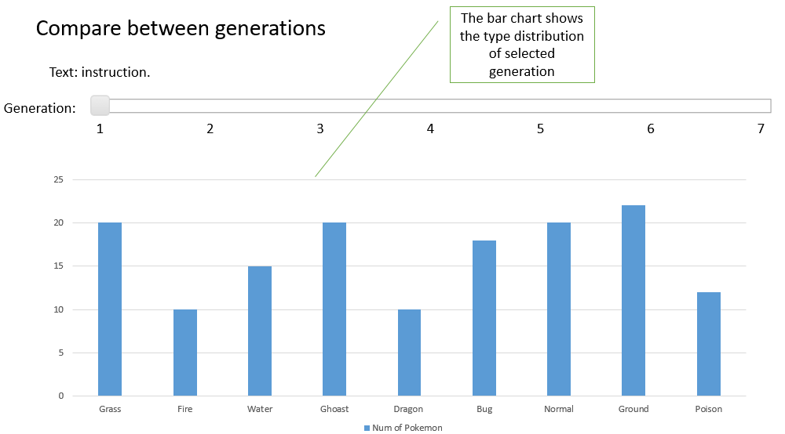  
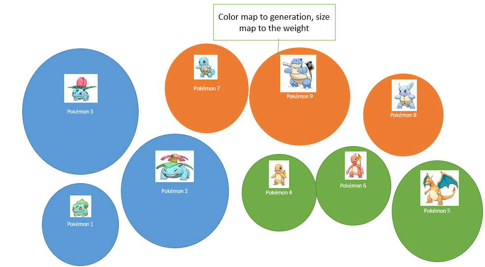  
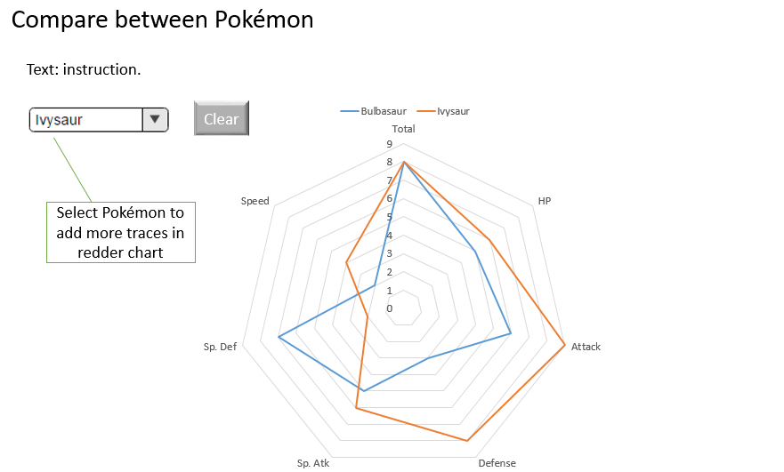  
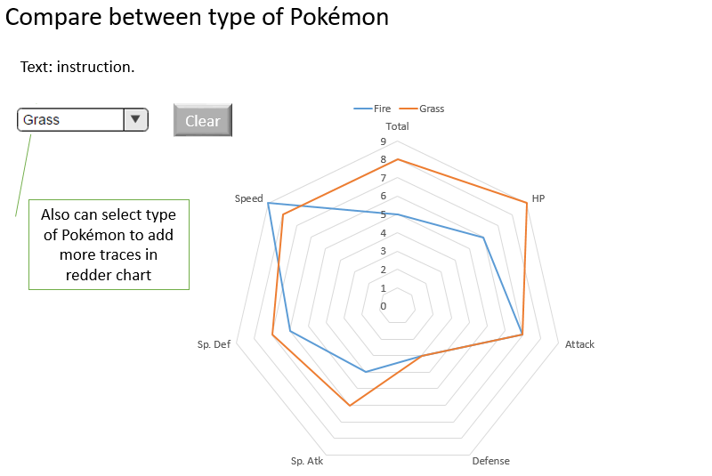  
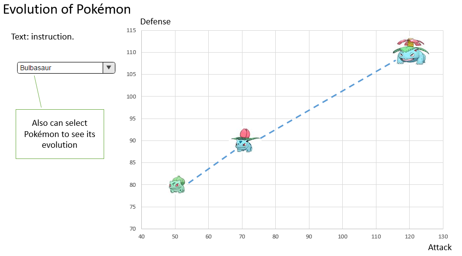  
  

##Must-Have Features  
1.	At least three separate types of charts  
  
2.	Mouse-over for more information on each chart  
  
3.	Select Generation by slider  
  
4.	Use sprites as representation points  

##Optional Features  
1. Visualize Evolutions  
  
2. Filter by Type  
  
3. Sort feature to separate data out by Generation or Type
  
4. Radar chart shows average stats for each Type  
  
5. Have slider move with viewer    
  
##Project Schedule  
| Due Date | Task |
| ------| ------ | 
| Friday 2/17 | 1. Prototype version of 3 Charts | 
| Thursday 2/23 | 1. Add design elements to web page  2. Tweak Charts|
| Monday 2/26 | 1. Apply Feedback  2. Attempt Optional Features| 
| Thursday 3/2 | 1. Tweak to Completion  2. Film Video|

##Appendix: Sketches
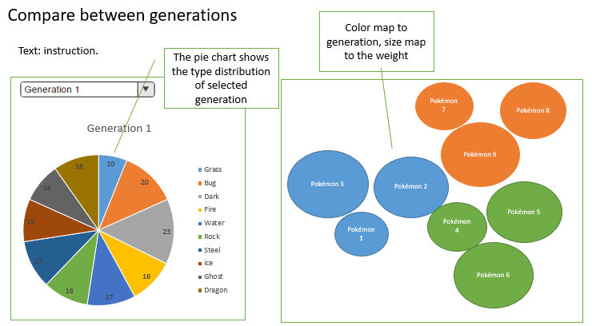  
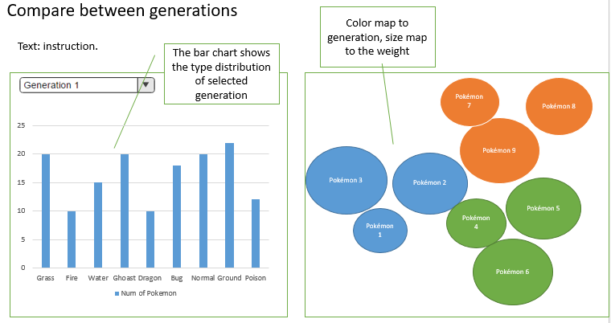  
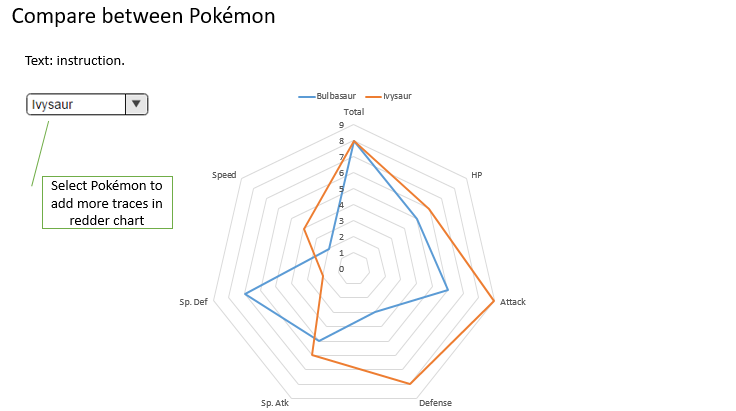  
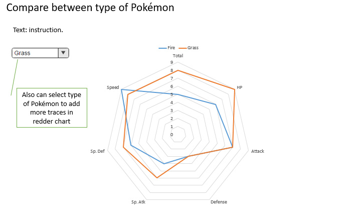  
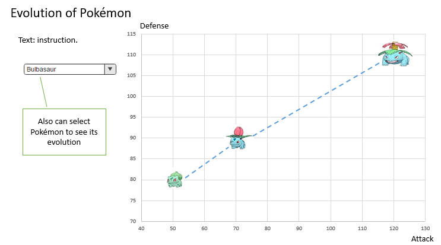  
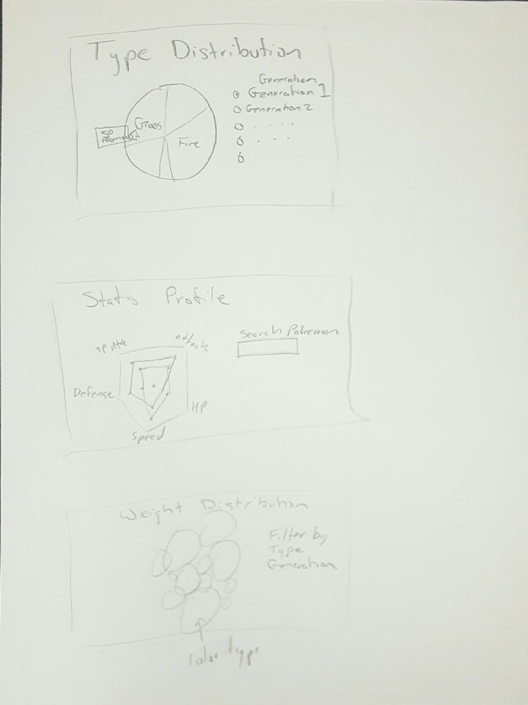  
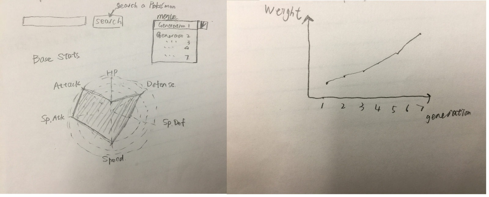  
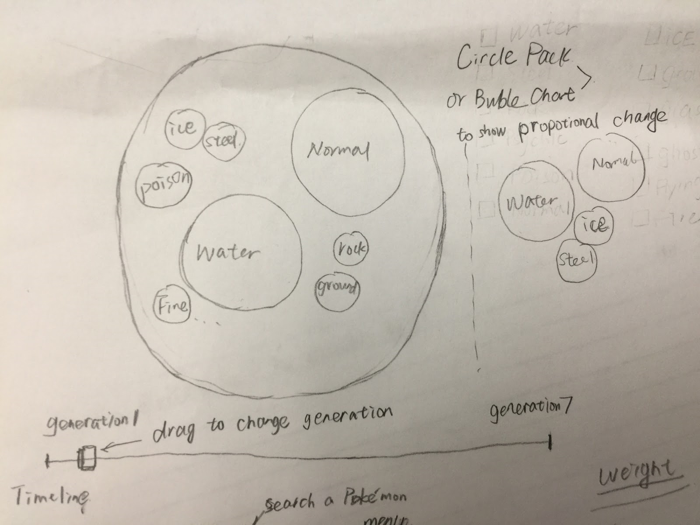  

  

 